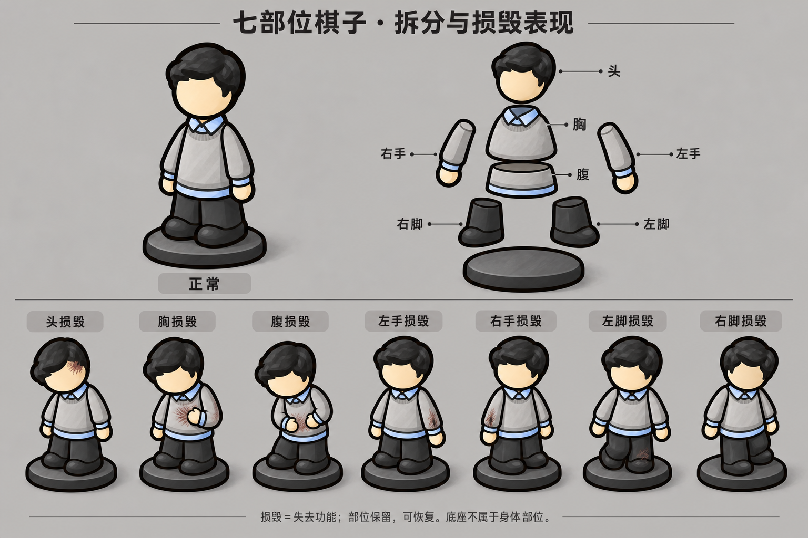

# 七部位卡通棋子：参考方案，待确认

用户要求：在带手参考图基础上更卡通，并完全按现有肢体系统拆分，体现损毁。此图是内置ImageGen制作的单张概念图，不是已切分的生产图层，也未替换游戏。

依据 docs/design/09-body-parts.md，损毁满值表示失去功能且可恢复，不是断肢。沿用 head / chest / abdomen / lhand / rhand / lfoot / rfoot 七键；底座为非身体装饰层。左右按角色自身定义，不能以屏幕左右直接绑定。腹部使用abdomen，兼容界面的belly别名。

## 拆分与表现方案

| 游戏部位 | 视觉组件 | 损毁视觉意图 |
|---|---|---|
| head | 头发、脸、头部配饰 | 头低垂或歪斜，局部损伤标记；不移除头，不直接等同死亡或眩晕状态 |
| chest | 上躯干、领口 | 胸部收缩、上身微塌，局部衣服损伤 |
| abdomen | 下躯干、腰部、衣摆 | 腰部屈曲和局部损伤；护腹动作仅在相应手可用时采用 |
| lhand/rhand | 对应整条袖臂、袖口与手掌 | 分别失去主动动作、无力下垂，不自动消失 |
| lfoot/rfoot | 对应裤腿与鞋 | 分别屈膝、拖脚、失去支撑；不自动生成拐杖或治疗道具 |

正常/损毁模块需要可组合：不能只制作七张互斥全身伤图，多部位同时损毁时不能互相覆盖。四肢与胸腹的旋转/位移通过关节点传播；头/手随躯干连接，鞋与底座接地。双脚损毁使用整体低伏等可读姿态，不做无支撑悬空。仅展示伤态，不凭姿势改变行动规则。

更卡通的方向：躯干缩短圆润，头适度增大，手脚简化清晰，保留桌游底座与通勤配色。此次独立腿脚、头身比例属于用户提出的新框架探索，尚未取代51号规范中的已确认v4基准。最终需要在72px实际尺寸验证各部位可读性，避免只依赖细伤痕和颜色。图中单腿动作及划痕仅表达意图，生产层需按左右ID校正及验证。

损毁显示读取现有部位值和getBodyPartDestroyMax，不另设损毁阈值、不写死第二套上限，不新增骨折通道。恢复后跟随状态恢复正常姿态。损伤划痕是风格化表达，不暗示所有攻击都会割破衣服。

## ImageGen提示词

Create a polished landscape game-character modular design reference sheet in Chinese. Reference image is approved office-worker pawn clothing/style. Evolve it into a slightly more cartoon-like compact articulated BOARD-GAME PAWN, not a realistic human: shorten the long cone torso, softly rounded shapes, slightly larger simple head but NOT oversized chibi, retain tapered overall silhouette and a wide thin oval base. Short black hair, blank cream face, grey sweater, pale blue collar/cuffs/hem, charcoal trousers. Add simple mitten hands and TWO short distinct trouser-leg-and-shoe pieces to communicate limb function, retain toy proportions and fixed three-quarter near-frontal view. Low saturation, clean dark outlines, simplified hand-painted texture. Uniform pale warm grey sheet background. Top title '七部位棋子 · 拆分与损毁表现'. Layout: upper left ONE large normal assembled pawn labelled '正常'; upper right ONE clear exploded technical illustration of the SAME pawn broken into EXACTLY SEVEN anatomical modules plus separate unlabelled oval base: head labelled '头', upper sweater torso '胸', lower sweater/waist '腹', character-left sleeve+hand '左手', character-right sleeve+hand '右手', character-left trouser leg+shoe '左脚', character-right trouser leg+shoe '右脚'. Labels and thin leader lines; left/right are character's anatomical left/right, NOT viewer's. Detachment here is ONLY a clean exploded assembly diagram, no injuries. Bottom section seven clearly separated evenly spaced full-pawn small examples on bases, identical character, each showing ONE different DISABLED body part with localized muted burgundy abrasion hatching AND unmistakable restrained pose change; all limbs remain attached. Label columns exactly '头损毁', '胸损毁', '腹损毁', '左手损毁', '右手损毁', '左脚损毁', '右脚损毁'. Head: head droops sideways with localized dark forehead abrasion. Chest: upper torso slumps, chest area localized scuff. Abdomen: bend at waist slightly clutch abdomen, localized lower-sweater scuff. Left/right hand: corresponding entire arm hangs limp with muted cuff/sleeve damage and lowered mitten. Left/right foot: corresponding knee bends and foot drags weakly while other leg bears weight. No bandages, casts, crutches or automatic medical treatment. No disappearing modules in damage examples, no severed limbs, no blood/gore, no X eye death symbols, no red glowing auras. Small footer '损毁＝失去功能；部位保留，可恢复。底座不属于身体部位。'. Readable clean typography, ample gutters. This is a concept reference sheet, not game-ready separated PNG assets. Preserve coherent same character across every view.

> 后续规则已修订：以[52号规范](../../../../docs/design/52-pawn-body-modules-and-poses.md)为准。头胸腹保留受伤效果，四肢可缺失；原图四肢均保留的伤态仅是历史探索。主角与普通NPC共用姿势，特殊Boss可独立制作。

