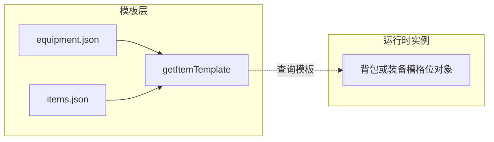

# 物品模板字段：分层计数与口径

本文档固化「一个物品在数据与运行时里有哪些字段」的分层口径，便于重构物品结构时对账；**权威构建逻辑**仍以 [`tools/build-items-json.mjs`](../../tools/build-items-json.mjs) 与 [`.cursor/rules/items-json-build-agent.mdc`](../../.cursor/rules/items-json-build-agent.mdc) 为准。

**复跑统计**：

- `npm run audit:item-keys`（[`tools/audit-item-template-keys.mjs`](../../tools/audit-item-template-keys.mjs)）：扫描 [`data/items.json`](../../data/items.json)、[`data/equipment.json`](../../data/equipment.json) 各表顶层模板键、**并集**键列表，以及 `use_effect` 子键（若存在）。
- `npm run audit:item-field-rules`（[`tools/audit-item-field-display-rules.mjs`](../../tools/audit-item-field-display-rules.mjs)）：模板字段路径与 [`data/item-field-display-rules.json`](../../data/item-field-display-rules.json) 对账，并输出 CSV/JSON 中旧轨恢复列与 `use_effect` 出现情况。最近一次落盘输出见 [`27-item-field-rules-audit-last-run.md`](27-item-field-rules-audit-last-run.md)。

输出随数据变化可能与下文快照略有出入。

---

## 1. 结论摘要（按提问口径）

| 口径 | 含义 | 数量级 |
|------|------|--------|
| **`items.json` 当前出现过的顶层模板键** | 合并 CSV 构建后的杂物/材料等模板 | 见 **§3**，当前扫描约 **37**（随数据增减） |
| **构建脚本一等公民 + 扩展列** | `rowToItem` 映射 + `handled` 白名单外非空 CSV 列原样写入 | 一等公民列约 **39**；扩展列 **无上限** |
| **`getItemTemplate` 可见模板** | **先** [`data/equipment.json`](../../data/equipment.json) **再** [`data/items.json`](../../data/items.json)，见 [`js/inventory-equipment.js`](../../js/inventory-equipment.js) | 两套模型叠加；装备与杂物键名不完全一致（如 `id` vs `item_id`） |
| **背包/地面等物品实例** | 与模板分离的格位对象 | 常见约 **5** 类字段，见 **§5** |

说明：`usable`、`use_buff_id`、`pharmacy_ingredient` 等由构建脚本支持，但若合并表中无对应非空行，则不会出现在当前 `items.json` 里。`use_effect`（旧轨即时生存恢复，子键曾含 `satiety` / `thirst` / `nutrition`）后续不进入新的物品信息分块，视为待迁移/待删除旧口径。

---

## 2. 模板合并与实例（关系示意）



---

## 3. `items.json`：顶层模板键（当前合并结果快照）

以下为一次性全表扫描得到的键集合（字典序）；**非上限**——任意 CSV 新列在非空时可写入模板（见构建脚本末尾扩展列逻辑）。

`accept_code`, `base_value`, `category`, `compost_inoculant_aerobic`, `compost_inoculant_anaerobic`, `convert_to_high`, `cooking_ingredient`, `desc_0`, `edible`, `edible_buff_id`, `fert_c`, `fert_n`, `fn`, `fn_before`, `food_buff_duration_ticks`, `fuel_points`, `info_module_set_id`, `item_id`, `name`, `name_0`, `placeholder_name`, `price_class`, `production_lines`, `quality`, `region_restrict`, `skill_coef`, `sn`, `source`, `spoilage_ticks`, `stack_limit`, `sub_category`, `tags`, `usable_regions`, `volatility`, `water_points`, `weapon_attack_power`, `weight_kg`

---

## 4. 构建脚本「核心映射」与扩展列

- **映射入口**：[`tools/build-items-json.mjs`](../../tools/build-items-json.mjs) 中 `rowToItem` 与 `handled` 集合。
- **语义**：身份与展示、分类标签、经济/区域、腐败、食用与 Buff、烹饪/制药/堆肥、灶台燃料与水、兵器数值、`info_module_set_id` 等。
- **扩展列**：未列入 `handled` 且单元格非空的列名 → 以**字符串**写入模板同名键（供 `item-info-modules` 的 `csv_field_text` 等读取）。

---

## 5. `equipment.json`：顶层模板键（当前文件快照）

当前扫描约 **18** 种（若新增装备条目带有 `backpack_slots` 等，键集合会增加）：

`damage_reduce_blunt_pct`, `damage_reduce_pierce_pct`, `damage_reduce_slash_pct`, `desc_0`, `desc_1`, `desc_2`, `display_skill_id`, `enchant_slots`, `equip_slot`, `id`, `name_0`, `name_1`, `name_2`, `pocket_slots`, `quality_tier`, `skill_coef`, `vest_slots`, `weight_kg`

文件头注释还约定背心/背包可有 `backpack_slots`、`backpack_weight_factor` 等——**条目未配置则不会出现在键统计中**。

---

## 6. 代码可能读取、但未必出现在上述 JSON 快照中的模板键

重构或清点时建议在心智模型中一并预留：

| 键 | 说明 |
|----|------|
| `attack_power` | 兵器底伤：`weapon_attack_power` 缺失时 [`js/combat-melee-resolve.js`](../../js/combat-melee-resolve.js) 可回落 |
| `stack_max` | [`js/inventory-equipment.js`](../../js/inventory-equipment.js) `getMaxStack`；注意构建将 `stack_limit` 固定为 **1**，与 CSV 历史文档可能不一致 |
| `req_innate_jingu` | UI 与筋骨门槛展示/判定相关 |
| `equip_slot` | 可装备物品来自装备模板或未来杂物模板扩展 |
| `damage_type_effects` | 战斗管线载体侧结构（若模板挂载） |

---

## 7. 物品实例（背包/容器格位）

与模板分离；[`copyItemInstance`](../../js/inventory-equipment.js) 典型字段：

- `item_id`（必填）
- `count`（可选）
- `quality_tier`（可选）
- `enchants`（可选数组）
- `ground_drop_tick`（可选，地面丢弃）

---

## 8. 字段展示知识归属（实现目标）

本节定义「物品信息 UI 分块」与「生活技能可见性」的目标口径。**字段本体仍是物品模板/实例的客观属性**；字段归类只影响物品信息如何分块展示、由什么技能解锁显示，**不改变字段数值、结算逻辑、配方匹配或存档语义**。

### 8.1 核心约束

1. **每个可展示字段必须有一个主显示块**，供策划稳定维护；可选配置引用块，用于同一字段在其它信息块中复用展示。
2. **字段可逐个绑定生活技能与显示等级**：字段有 `skill_id` 时，按该技能等级判断可见性；字段自己的 `level_min` 独立于所在块。
3. **低等级统一显示锁定状态**，不直接暴露字段值；锁定文案可由字段规则配置。
4. **renderer 由策划配置**，用于把原始字段值转成玩家可读信息；例如 Buff 摘要、tick 时长、布尔标签、数值说明等。
5. **规则放全局字段显示规则表**（已落盘 [`data/item-field-display-rules.json`](../../data/item-field-display-rules.json)）；必要时未来允许单物品覆盖。
6. **无技能绑定的其它块默认先隐藏**；后续只要补字段规则即可随时开放显示。
7. **常规信息块默认不绑定生活技能**，但名称/描述内部仍遵守现有 `survival_language` 显示逻辑。

### 8.1.1 全局规则文件 `item-field-display-rules.json`（数据契约）

| 顶层键 | 含义 |
|--------|------|
| `schema_version` | 字符串版本号，与实现演进对齐 |
| `blocks` | `block_id` → `{ display_name, default_skill_id?, default_visible? }`；`default_visible` 为 false 时，该块在无显式字段开放前默认不参与分块展示编排 |
| `fields` | 模板字段键（含 `use_effect.*` 点分路径）→ `{ primary_block, reference_blocks, skill_id, level_min, locked_hint, renderer, value_type, visible_by_default?, deprecated? }`；`skill_id` 可为 `null` 表示不按生活技能门闸（仍可由 renderer 实现语言等横切逻辑） |
| `renderers` | `renderer_id` → `{ display_name, value_type_hint }`，供策划与后续运行时校验 |

**初始字段规则来源**：与本节 **§8.2** 表一致，并已写入该 JSON：`regular`（`edible`、名称/描述系列、`weight_kg`）、`cooking_station`、`food_detail`、`pharmacy`、`planting_compost`；旧轨 `use_effect.satiety` / `thirst` / `nutrition` 以 `deprecated: true` 归入块 `legacy_use_effect`，`renderer: hidden`，不进入新展示分块。

**技能 id 核对（仓库现状）**：

- [`data/survival-skills.json`](../../data/survival-skills.json) **仅登记** `survival_*` 元数据，**不包含** `life_cooking` / `life_pharmacy` / `life_planting`（生活技能等级走 `InventoryEquipment.skills` 等路径，与生存技能登记表分离，见 [`docs/design/11-skills.md`](11-skills.md) / [`data/life-skill-recipe-interfaces.json`](../../data/life-skill-recipe-interfaces.json)）。
- **`life_planting` blocker**：当前仓库除本文档 §8.2 的规划表外，**未**在 `life-skill-recipe-interfaces.json`、配方接口或其它数据表中登记该技能 id；规则 JSON 中堆肥/种植类字段仍按策划占位绑定 `life_planting`，**待技能 id 正式注册后再接运行时门闸校验**（勿自行改为其它 id 替代）。

建议规则形状（示例，非单条字段全貌）：

```json
{
  "field": "spoilage_ticks",
  "primary_block": "food_detail",
  "reference_blocks": [],
  "skill_id": "life_cooking",
  "level_min": 2,
  "locked_hint": "烹饪经验不足，无法判断食物保鲜情况",
  "renderer": "tick_duration"
}
```

### 8.2 当前字段归属草案

| 字段 | 主显示块 | 技能门闸 | 建议等级 | 说明 |
|------|----------|----------|----------|------|
| `edible` | 常规信息 | 无 | - | 是否可食用；只表示基础可用状态，不归烹饪 |
| `name` / `name_0` / `name_1` / `name_2` / `sn` / `placeholder_name` | 常规信息 | `survival_language` 既有逻辑 | 既有阈值 | UI 块归常规信息，具体名称显示仍走语言规则 |
| `fn` / `fn_before` / `desc_0` / `desc_1` / `desc_2` | 常规信息 | `survival_language` 既有逻辑 | 既有阈值 | UI 块归常规信息，具体描述显示仍走语言规则 |
| `weight_kg` | 常规信息 | 无 | - | 通用重量 |
| `cooking_ingredient` | 烹饪工位信息 | `life_cooking` | 1 | 是否可作为烹饪投料 |
| `fuel_points` | 烹饪工位信息 | `life_cooking` | 1 | 灶台燃料价值 |
| `water_points` | 烹饪工位信息 | `life_cooking` | 1 | 料理水价值 |
| `spoilage_ticks` | 食物细节 | `life_cooking` | 2 | 食物保鲜/腐败判断 |
| `edible_buff_id` | 食物细节 | `life_cooking` | 3 | 食用后的效果；需 renderer 转成 Buff 摘要 |
| `food_buff_duration_ticks` | 食物细节 | `life_cooking` | 3 | 食物效果持续时间 |
| `pharmacy_ingredient` | 制药信息 | `life_pharmacy` | 1 | 是否可作为制药投料 |
| `fert_c` | 堆肥/种植信息 | `life_planting` | 1 | 碳贡献 |
| `fert_n` | 堆肥/种植信息 | `life_planting` | 1 | 氮贡献 |
| `compost_inoculant_aerobic` | 堆肥/种植信息 | `life_planting` | 2 | 好氧菌剂 |
| `compost_inoculant_anaerobic` | 堆肥/种植信息 | `life_planting` | 2 | 厌氧菌剂 |
| `category` / `sub_category` / `tags` / `source` / `production_lines` | 分类与来源 | 默认隐藏 | - | 可用于筛选/辅助路由，后续按字段规则开放 |
| `stack_limit` / `stack_max` | 容器/堆叠信息 | 默认隐藏 | - | 通用背包/容器规则 |
| `quality` / `quality_tier` | 品质信息 | 默认隐藏 | - | 当前先不绑定，未来可接鉴定 |
| `base_value` / `price_class` / `volatility` / `region_restrict` / `usable_regions` / `accept_code` / `convert_to_high` | 经济/区域信息 | 默认隐藏 | - | 贸易/鉴定口径未定 |
| `usable` / `use_buff_id` | 通用使用信息 | 默认隐藏 | - | 非食用、非料理效果 |
| `weapon_attack_power` / `attack_power` / `skill_coef` / `req_innate_jingu` / `damage_type_effects` | 战斗信息 | 默认隐藏 | - | 不归生活技能，后续可接战斗/鉴定 |
| `equip_slot` / `damage_reduce_slash_pct` / `damage_reduce_pierce_pct` / `damage_reduce_blunt_pct` / `pocket_slots` / `vest_slots` / `backpack_slots` / `backpack_weight_factor` / `enchant_slots` | 装备信息 | 默认隐藏 | - | 装备属性块，后续可接鉴定 |
| `display_skill_id` / `info_module_set_id` | 内部/元数据 | 默认不展示 | - | 展示规则和 UI 编排字段 |

### 8.3 模板生成规则与实例字段

| 字段 | 主显示块 | 说明 |
|------|----------|------|
| `numeric_rolls` | 模板生成规则 | 默认不展示；用于声明实例生成时的数值浮动规格 |
| `resolved_rolls` | 跟随被 roll 的字段 | 例如 roll 了 `base_value` 则进入经济块，roll 了 `weapon_attack_power` 则进入战斗块 |
| `count` | 实例状态 | 数量，默认不绑生活技能 |
| `enchants` | 实例词条 | 暂不归生活技能，未来可接鉴定/改造 |
| `ground_drop_tick` | 实例状态 | 默认不展示 |

### 8.4 明确废弃

- `use_effect.satiety` / `use_effect.thirst` / `use_effect.nutrition`：旧轨即时生存恢复，不进入新的信息分块。后续消耗/食用效果以 `edible` + `edible_buff_id` 或其它新轨为准。
- CSV 构建侧历史列名 `satiety_restore` / `thirst_restore` / `nutrition_restore` 仍映射到上述子键（见 [`.cursor/rules/items-json-build-agent.mdc`](../../.cursor/rules/items-json-build-agent.mdc)）；**不**纳入 [`data/item-field-display-rules.json`](../../data/item-field-display-rules.json) 的可展示字段集合，仅在规则表中以 `use_effect.*` 键标记 `deprecated` 供对账。

### 8.4.1 CSV 旧轨列现状与迁移（deprecated）

| 项目 | 说明 |
|------|------|
| **表头** | `consumables_base.csv` 仍含 `satiety_restore` / `thirst_restore` / `nutrition_restore`；其余合并表（`materials_all` / `product_base` / `currency_base` / `compost_matrix_base`）当前可无此列。 |
| **数据** | 当前行为：食物行多为空列；药剂等行可为 `0,0,0`（全零经 `buildUseEffect` **不会**写入 `use_effect`）。 |
| **JSON** | 以仓库最近一次 `npm run audit:item-field-rules` 为准；若计数为 0，表示 `items.json` 中尚无带分量的 `use_effect`。 |
| **迁移建议** | 新数据食用主轨一律 **`edible` + `edible_buff_id`**；旧轨列仅兼容保留。**勿在未评审运行时食用链的前提下整表删列**；若未来删列，须同步 `tools/build-items-json.mjs` 的 `buildUseEffect` / `handled` 与编辑器表头迁移。 |
| **对账** | `npm run audit:item-field-rules` |

---

## 9. `tools/item-editor.html` 后续改进要求

当前 [`tools/item-editor.html`](../../tools/item-editor.html) 已支持 CSV 行列编辑、Buff 列表导入、腐败/灶台燃料水/制药投料快捷输入、`info_module_set_id` 绑定，以及 `item-info-modules` 模块集管理。但它仍是「编辑字段值 + 手工模块集」模型；为配合字段展示知识归属，需要补以下能力：

1. **全局字段显示规则表管理区**：载入/编辑/导出 [`data/item-field-display-rules.json`](../../data/item-field-display-rules.json)（已建契约骨架），每条规则与 JSON `fields` 条目一致，包含 `primary_block`、`reference_blocks`、`skill_id`、`level_min`、`locked_hint`、`renderer` 等。
2. **字段列表显示归属状态**：在现有字段列表中展示主块、技能门闸、等级、renderer、是否未配置规则，便于策划对账。
3. **字段规则快捷模板**：提供「常规信息」「烹饪工位信息」「食物细节」「制药信息」「堆肥/种植信息」「隐藏/内部字段」等预设，一键写入规则。
4. **字段级解锁优先于模块级解锁**：`item-info-modules` 现有 module `unlock` 可继续保留，但默认字段展示应以字段规则为准，避免同一字段在不同模块集中重复配置。
5. **renderer 选择器**：至少支持 `raw_text`、`bool_tag`、`number`、`tick_duration`、`buff_summary`、`hidden` 等类型；`edible_buff_id` 应能借助本地 Buff 列表预览名称/摘要。
6. **旧轨字段提示**：`satiety_restore` / `thirst_restore` / `nutrition_restore` 相关提示应标记为废弃，避免策划继续新增旧轨数据。
7. **校验与预览**：提供未归类字段检查、规则引用字段是否存在检查、技能 id / renderer 合法性检查；选择物品并模拟技能等级后，预览最终 tooltip 分块、字段可见/锁定状态。
8. **保留模块集但调整职责**：`item-info-modules` 后续作为特殊布局/额外文案/个别物品覆盖入口，不再承担默认字段归属的唯一来源。

---

## 10. 后续结构化讨论维度（非强制方案）

1. **静态模板** vs **存档实例** vs **衍生展示**（语言等级、`ItemValue` 有效基价等）。
2. **横切关注点**：标识、文案、物理（重量）、经济、生存消耗、生产门禁（烹饪/制药/堆肥）、战斗、装备穿戴、UI 模块引用。
3. **扩展策略**：当前为「宽表 JSON + 任意 CSV 列渗入」；若收敛为分组命名空间或组件式字段，需单独评审迁移成本。

---

## 11. 相关文档与规则

- 物品表写作风格：`capitalism/items_template_and_style.md`
- 构建与 CSV 口径：`.cursor/rules/items-json-build-agent.mdc`
- 全局字段展示规则（契约数据）：[`data/item-field-display-rules.json`](../../data/item-field-display-rules.json)
- 悬浮窗模块化：`.cursor/rules/item-tooltip-modules-agent.mdc`
- 物品展示语言：`docs/design` 与 `.cursor/rules/item-display-language-agent.mdc`
- 数值区间随机（模板/实例分轨）：[`26-item-numeric-rolls-resolved-rolls.md`](26-item-numeric-rolls-resolved-rolls.md)

---

## 12. 实现状态（集成验收）

本节记录**当前仓库**相对 §8～§9 的落地程度；以代码与 `npm run audit:item-keys` / `npm run audit:item-field-rules` 为准，不臆造未接线能力。

### 12.1 已落地

| 目标 | 说明 |
|------|------|
| 字段规则数据加载 | `js/scene-app.js` → `loadConfig` 中 `fetch('data/item-field-display-rules.json')`，在 `Promise.all` 回调内 `ItemFieldDisplayRules.setTable(arr[22])`（与 `item-info-modules.json` 的 `arr[21]` 槽位一致）。失败或非 JSON 时降级为 `null`，不阻断整包配置。 |
| 脚本顺序 | `index.html`：`js/item-field-display-rules.js` 在 `js/scene-app.js` 之前。 |
| Tooltip 信息块 | `buildItemTooltipHtmlForTemplate`：名称 + 描述（语言链）→ `ItemInfoModules.renderTooltipModulesHtml` → `buildItemFieldRulesHtmlAppend`（`ItemFieldDisplayRules.renderFieldBlocksHtml`）。 |
| 背包详情信息块 | `updateBackpackPanel` → `renderDetail`：在 `bp-detail-modules` 之后挂载 `bp-detail-field-rules`，与 tooltip 同源 `buildItemFieldRulesHtmlAppend`。 |
| 低等级 / 高等级 | 有 `skill_id` 且未达 `level_min`：展示 `locked_hint`；达到等级：按 `renderer` 输出值。无 `skill_id` 且块 `default_visible === true`（如 `regular`）的字段直接按值渲染。 |
| 常规块与生活技能 | `weight_kg`、`edible` 等 `skill_id: null` 归入 `regular`；烹饪工位/食物细节走 `life_cooking`，制药走 `life_pharmacy`，堆肥/种植走 `life_planting`（读 `InventoryEquipment.getCharacterForDisplay().skills`）。 |
| 名称/描述主链 | 仍由 `getDisplayName` / `getDisplayDesc` + `survival_language` 决定；规则中带 `language_gated_name` / `language_gated_desc` 的字段在 `isFieldVisible` 中排除，**不**在 KV 分块重复输出。 |
| `use_effect` 旧轨 | 规则表中 `use_effect.*` 为 `renderer: hidden` + `deprecated`；运行时对 `use_effect.` 前缀字段额外不进入收集。不读取 `use_effect` 进新分块。 |
| item-editor | `tools/item-editor.html` 含字段规则区：本地文件载入、编辑、`exportFieldRulesJson` 导出；页面初始化时 `fetch('../data/item-field-display-rules.json')` 尝试预载。 |
| 审计脚本 | `npm run audit:item-keys`、`npm run audit:item-field-rules` 可执行；后者报告规则表独有字段、模板未覆盖字段、CSV 旧恢复列、`items.json` 中带 `use_effect` 的数量、deprecated 字段列表。 |

### 12.2 待办 / 策划渐进项（非阻断）

- **规则覆盖率**：审计第 3 节「模板出现但未在规则表覆盖的字段」仍会有大量键（如 `item_id`、`id`、装备减伤等）；属按块逐步补规则，不是运行时错误。
- **`item-info-modules` 与字段规则职责**：§9.4 / §9.8 所述「字段规则优先、模块集作覆盖」仍为方向性要求；当前两者并存于 tooltip/详情，需后续收敛重复展示策略。
- **§9 高级能力**：如「选择物品 + 模拟技能等级预览整段 tooltip」等若在编辑器中未出现按钮，则仍为**待做**（以 `tools/item-editor.html` 实际 UI 为准）。

### 12.3 已知缺口

- **`life_planting`**：与 §8.1.1 一致，技能 id 在部分登记表/存档中可能尚未稳定存在；无该技能条目时等级视为 0，堆肥/种植类字段保持锁定或仅常规块。
- **`pharmacy_ingredient`**：规则表已定义，但当前 `items.json` 扫描可暂无该键实例（审计 §2「规则有而数据无」）；以 CSV/构建落数据后自然对齐。
- **装备模板**：`equipment.json` 独有键多数未配置字段规则，不进入新分块；装备向展示仍依赖未来块规划或 `info_module_set_id`。
