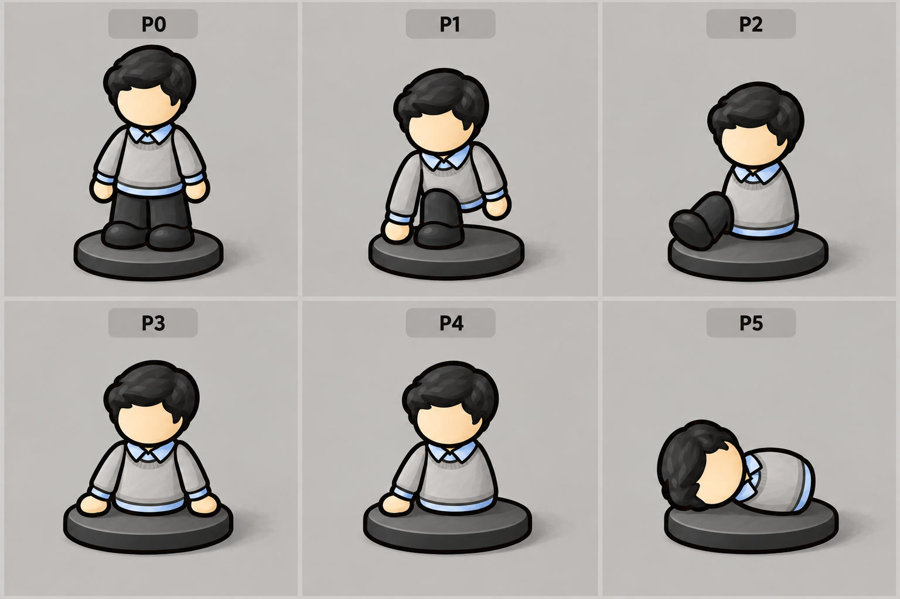
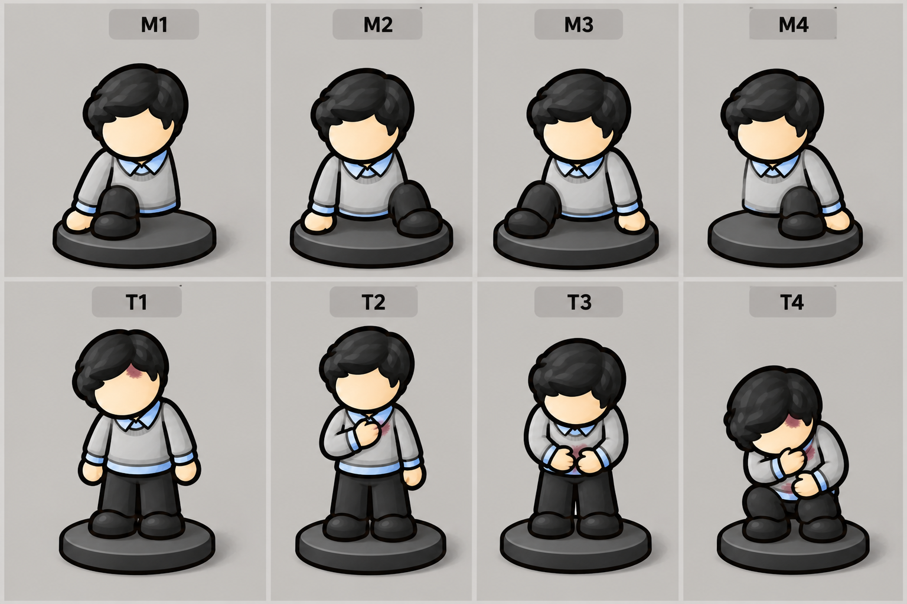

# 53. 共用棋子姿势设计 v1

2026-09-14：第一轮姿势设计已制作，待视觉反馈；不是游戏实装，也不是已拆好的透明图层。依据[52号规则](52-pawn-body-modules-and-poses.md)，主角与普通NPC共用，特殊Boss可用专用姿势集。

## 支撑姿势图

| 图号 | 图中状态（角色自身左右） | 支撑设计 |
|---|---|---|
| P0 | 双腿正常，可有0/1/2只手 | 双腿站立；手缺失仅隐藏对应臂，不影响双腿承重 |
| P1 | 左腿缺失，双手可用 | 降低重心，右腿屈曲、右手撑地；左腿正常时镜像姿势几何 |
| P2 | 双手及左腿缺失 | 腹部底面坐在底座，右腿屈曲前伸；单腿不足以维持高站姿 |
| P3 | 双腿缺失，双手可用 | 腹部落座、双手两侧撑地 |
| P4 | 双腿及左手缺失 | 腹部落座、右手单侧撑地，重心向该侧靠拢 |
| P5 | 四肢全部缺失 | 头胸腹组合侧卧，胸腹接触底座，不悬空直立 |

P0双手缺失的站姿直接复用站立骨架并隐藏双臂，不另画整张图。P1/P2/P4需要左右几何版本；几何镜像不意味着镜像发型、文字、单侧配饰或交换损毁ID。

## 一手一腿组合及头胸腹伤态

M系列以接近正面展示，角色右侧位于画面左。下表列的是**剩余**肢体，避免把“剩余”与“损毁”混淆。

| 图号 | 剩余手 | 剩余腿 | 实际缺失 | 支撑设计 |
|---|---|---|---|---|
| M1 | 右手 | 右腿 | 左手、左腿 | 同侧支撑；腹部同时落座防止侧翻 |
| M2 | 右手 | 左腿 | 左手、右腿 | 交叉两点支撑；腰部降低，腹部可接触底座 |
| M3 | 左手 | 右腿 | 右手、左腿 | M2的对应侧支撑；保持固定逻辑ID |
| M4 | 左手 | 左腿 | 右手、右腿 | 同侧支撑；腹部同时落座防止侧翻 |

两种同侧组合不是“站在独腿上摆造型”：腹部与底座的接触提供第三处稳定支撑。出图已按画面左右逐项核对四种组合，每个M图都只有一臂一腿。

| 图号 | 局部状态 | 动作设计 |
|---|---|---|
| T1 | 头损毁 | 头部侧垂、局部暗红伤效，头始终存在 |
| T2 | 胸损毁 | 肩胸收缩，空闲手可护胸，胸始终存在 |
| T3 | 腹损毁 | 屈腰，空闲手可护腹，腹始终存在 |
| T4 | 头胸腹同时损毁示例 | 双腿可用时低蹲蜷缩，头低垂；图示不是所有缺肢状态通用的全身贴图 |

## 组合顺序与动作冲突

1. 由真实损毁状态隐藏四肢；头胸腹始终保留。
2. 按剩余手脚选P/M支撑姿势，先固定底座接触点。
3. 将撑地的手标为占用，不能再拿来护胸或护腹。
4. 叠加头胸腹伤效和有限的局部姿态偏移，不推离接触点。
5. 只有空闲手能护住伤处。v1提案：腹部护持优先于胸部；无空闲手时只显示局部伤效、低头/塌胸/屈腰，不长出缺失的手。该优先顺序是表现选择，不是游戏数值规则。
6. 多处躯干伤态不能直接相加旋转到不自然的角度：限制为当前支撑姿势允许的范围；侧卧时优先维持侧卧支撑，局部伤效保证识别。
7. 组合后由剩余部件的当前轮廓产生投影，缺失肢体和原站姿的影子不得残留。

底座位置及尺寸不随伤态改变。坐倒和侧卧时自然降低视觉高度，不把它们重新拉伸到站姿72px。姿态切换遵循当前游戏的减少动态偏好；此轮尚未设计攻击或移动动画。

## 可复用数据与校验

[共用状态映射](../../assets/map/isometric/concepts/shared-pose-map-v1.json)列出全部16种四肢组合的姿势、显隐、支撑部位和空闲手。叠加头胸腹的8种状态后，对全部128种组合进行了设计数据检查：均有映射、支撑不引用缺失部位、头胸腹不隐藏。

这不是渲染验收：连接点、关节转角、接缝、投影、72px下伤效可读性和动画过渡还需要在实际模块样板里验证。特别是图中局部红色伤痕缩小时可能不明显，最终应以显隐和大姿态为主，伤痕为辅。

目前交付两张姿势整图、一份可复用状态映射及[完整ImageGen提示词](../../assets/map/isometric/concepts/shared-pose-prompts-v1.md)。不将生成大图误称为可直接加载的分层素材。

> [完整损毁组合与数据v2](54-pawn-combined-injury-poses.md)：显式保存128个状态，包含P3/P4/P5共32个变体；后续使用v2，v1仅作历史。数据已校验，未实装。
