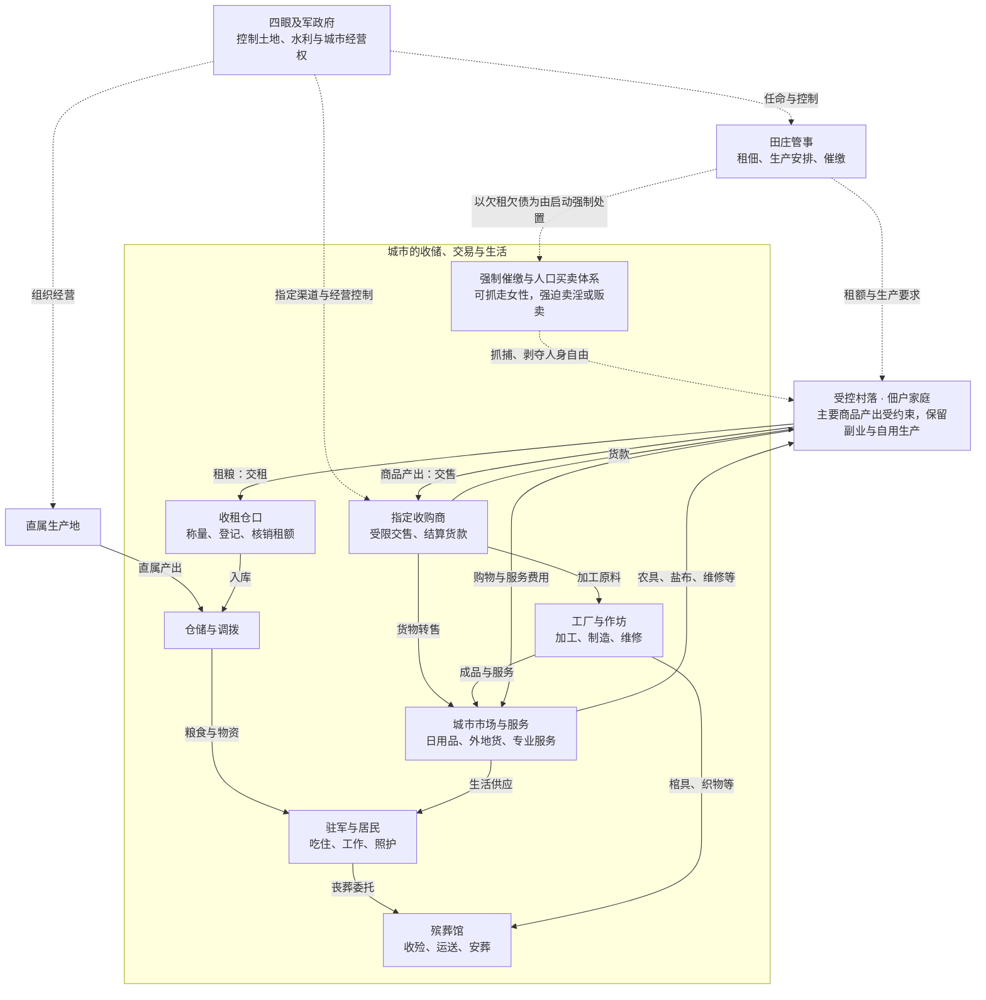

# 四眼之城：广州原型城市运作底稿

更新：2026-09-13。状态：讨论草案，不是剧情定稿或实现要求。

最新阅读口径：§10 汇总能源与叙事的已确认结论，§11 为百废待兴阶段的基建行业讨论建议。前文涉及逐项计算产量、人口承载力的探索要求已由 §10.1 取消。

## 1. 已确认方向与研究边界

- 完全剥离主角，从城市自身如何运作开始构建。
- 以民国时期广州为主要历史原型，拆分城市功能、行业、组织及生活方式。
- 对象为既有剧情中四眼控制的最大城市；殡葬馆纳入城市生活体系。
- 城市起源已补充：四眼是军阀，先带领部众占领战乱后荒废的旧城市，再组织修复和建设。城市保有旧基建框架，发展受人力与组织能力不足限制，并具有一定工业化和交易中心属性。
- 城市周边存在卫星村落，村落以种植、养殖等营生生产，出售产出以换取其他物资；生活技能从这些既有生产活动中找到社会位置。
- 村落应按混合营生理解，不能按一种技能分配一个单一功能村。村落技术水平偏低为当前讨论方向，具体能源、设备与覆盖范围尚未定稿。
- 四眼直接控制本地区最好的部分水土用于生产，是其经济基础之一。去村落收粮可能兼有控制目的，不能仅解释为城市缺粮；直接经营、租佃、征收及采购的具体制度仍待确定。
- 后续确认：本稿所讨论的受控村落土地由四眼控制，农户租佃生产；四眼通过租佃、收粮和销售渠道限制，有意维持村落对外产出的专业化与对城市的依赖。欠租、欠债可成为抓走农户家庭女性、强迫卖淫或人口买卖的借口。此为架空统治制度，不是历史广州事实；具体租额、执行程序和处置差异未定。
- 先解释人的需求、劳动、关系和制度，再形成具体人物与事件。
- 既有世界观见 [剧情大纲](30-story-outline-blackout.md)。本稿不改写其中的七阀分工与主线。

以下属于工作建议，尚未由用户逐项确认：参考窗口取1920年代至1930年代前期；具体机构、供给方式、收费和街区安排。常住两万人只是此前讨论建议，不作为确定人口，也不用于本轮数值推算。

## 2. 历史参考与架空转换

历史广州、游戏中的旧时代城市、游戏当下的城市是三个不同对象。历史资料用于理解运作方式；游戏旧时代的技术水平与崩溃过程不能直接等同于民国。

已核实的参考：

- 广州近代城市形态到新中国成立前基本形成古城、西关、南关、东山、河南五个城区板块。用途：研究街区形成，不能把后期格局直接当成1920年的固定地图。[广州市档案馆：老城提质](https://www.gzdaj.gov.cn/gzdt/gnxw/content/post_252700.html)
- 广州1908年已有水厂供水，1920年代末至1930年代继续扩建，1936年自来水用户超过四万户；历史上也存在河水、井水与挑水服务。用途：技术已经存在，不代表所有居民都能同等取得。[广州市水务局：广州饮水史](https://swj.gz.gov.cn/tpxw/content/post_10467394.html)

下文为架空城市推演，不声称每项职业、制度或流程均已获民国广州史料证明。具体历史称谓、收费制度、行业组织和殡葬惯例需另行考据。

## 3. 城市功能总表

本节为通用需求检查表。当前城市的功能组织和恢复脉络以 §7 为准，不将各项视为同时具备、同等恢复。

“谁付钱”记录候选负担方式；不代表确定了财政制度。家庭内无偿劳动也计入城市运作。

| 功能 | 需求与从业者 | 组织与物资来源 | 谁付钱或出力 | 规矩与空间 | 周期变化与待解问题 |
|---|---|---|---|---|---|
| 食物供给 | 粮商、菜贩、渔户、屠户、加工匠、饭铺、家庭炊事 | 周边农户、水路来货；收购、批发、零售、加工 | 家庭、食肆、包伙雇主 | 市场、仓库、加工场；秤量、损耗、赊账 | 收成、雨季、鲜货损耗；本地粮与外来粮各占多少？ |
| 饮水 | 取水、处理、挑运、管道修理 | 水井、取水点、残存供水设施 | 用户、业主、共同筹资者 | 水源、公共取水处、住宅；水质与取用顺序 | 枯水、污染、设备停运；哪些设施能维护？ |
| 燃料与照明 | 柴炭商、燃料运输、炉具修理、照明维护 | 林地与外来燃料；旧设施及替代燃料 | 家庭、作坊、街区或管理者 | 柴炭堆场、炉房；储存与防火 | 潮湿、涨价、原料断供；旧能源体系保留多少？ |
| 居住与营造 | 房东、中人、泥水木匠、客栈、家庭维护 | 房产、砖瓦木料、维修劳动 | 租客、业主、提供宿舍的雇主 | 铺宅、合院、通铺；租约与转租 | 雨漏、失火、迁入迁出；无固定收入者住哪里？ |
| 交通与仓储 | 船户、渡工、搬运、车夫、仓栈、修船 | 水路陆路、船车、装卸劳动 | 货主与乘客，经价格转给购买者 | 岸线、道路、仓区；交接与损坏赔偿 | 水位、天气、赶集；与青面仔控制范围如何衔接？ |
| 生产与修理 | 衣物、金属、竹木、陶器、工具加工维修 | 家庭生产、作坊、合伙；原料与废料回收 | 雇主、订货者、顾客 | 作坊与店宅；师徒、交期、质量 | 订单、农忙、原料短缺；与瘸子产业边界如何衔接？ |
| 交易与信用 | 商贩、经纪、当铺、借贷、账房 | 自有资金、合伙资金、信用与抵押 | 买卖双方、借款者 | 市场与商号；货币、度量衡、契据 | 周转、收账、挤兑；四眼公证的执行范围？ |
| 用工与劳动力延续 | 介绍人、雇主、师徒、短工、佣工、照护者 | 家庭、同乡、同行、宿舍 | 工资、包食宿、家庭无偿劳动 | 招工点、作坊、住处；雇佣与离职 | 旺淡季、工伤、婚育；债务与人身依附边界？ |
| 管理与公共安全 | 巡查、收取费用、登记、裁断、消防、道路堤岸维护 | 四眼属下、街区组织、受托经营者 | 收费、征收、共同出资或摊派 | 办事处、街道、河岸；权责与申诉 | 火灾、洪水、停工；谁监督办事的人？ |
| 卫生与废弃物 | 清扫、清沟、清粪、废物收集分拣 | 街区、家庭、承揽者；可能接入郊外利用 | 住户、铺户、城市资金及可回收物收入 | 厕所、沟渠、转运点；通行与处理范围 | 炎热、暴雨、淤塞；废物最终去哪里？ |
| 医疗与照护 | 医者、药铺、接生、看护、家庭照顾 | 私人服务、互助与救济；药材及器具 | 患者、家人、雇主或救济资金 | 医馆、住家、救济处；诊费、责任 | 疫病、工伤、生产；无支付能力者如何获得照护？ |
| 教育与信息 | 教师、代笔、印刷、书铺、邮递、报讯 | 家庭、学堂、商号；纸墨与通信网络 | 家庭、顾客、商户、资助者 | 学堂、书铺、消息聚集处 | 入学、考试、商业消息；谁识字、谁掌握档案？ |
| 社交与娱乐 | 茶楼、酒楼、戏班、游艺、赌场、妓院 | 商业经营、社群活动、家庭聚会 | 消费者、邀请者、出资者 | 街市、戏场、店内；准入与经营权 | 节庆、收入、夜间通行；不同人的闲暇有多少？ |
| 信仰与互助 | 庙宇、宗族、同乡组织、善堂 | 捐助、会费、共有财产与无偿劳动 | 家庭、成员、捐助者 | 庙、会馆、救济处；资格与分配 | 节庆、灾荒、迁徙；谁会被排除在外？ |
| 身后事 | 报丧、收殓、棺木、仪式、运输、掘墓、记录 | 家属、行业服务、互助救济、城市委托 | 家属、同乡工友、救济或城市资金 | 家宅、殡葬馆、运输道路、墓地 | 炎热、疫病、归葬；无人认领与贫困者谁负责？ |

## 4. 第一项展开：一座城如何吃饭

### 4.1 供给链草案

产地 → 收购与集货 → 运送 → 验货称量 → 储存或加工 → 零售与供餐 → 家庭和工作场所 → 剩余物处理。

不是所有食物都经过全部环节。近郊菜农可能直接零售；粮食可能先入仓再分批加工；鲜鱼需尽快售出或处理。暂不假定普遍冷藏。

| 食物 | 候选来源与周转 | 所需劳动和设施 | 需要追踪的剩余物 |
|---|---|---|---|
| 主粮 | 郊外与水路输入；可储存但需防潮虫鼠 | 收购、搬运、仓储、碾制、称量、零售 | 谷壳、米糠、破袋、受潮损耗 |
| 菜蔬 | 近郊为候选；频繁补货、尽快售出 | 采收、挑运、摊卖、清洗整理 | 菜叶、泥土、包装与废水 |
| 鱼类 | 河海捕捞、养殖的具体比例待定；鲜卖或加工 | 船运、分拣、盐腌或干制 | 鱼杂、盐水、坏货 |
| 肉蛋 | 活畜禽入城或近郊处理的方案待定 | 饲养、运送、屠宰、分割、销售 | 皮骨、内脏、污水；用途需按条件决定 |
| 油盐与耐存副食 | 外来盐、油料及本地加工为候选 | 榨制、腌制、容器制作与销售 | 油渣、容器、加工损耗 |

剩余物不默认都可安全利用；回收用途、加工成本和最终弃置地点须分别成立。

### 4.2 同一条街上的吃饭方式

工作假设：

- 有厨房、有稳定收入的家庭可以买粮、存粮、开伙，同时承担燃料与炊事劳动。
- 租住通铺的短工可能依赖熟食摊和包饭；即使米价较低，也未必有锅灶和时间自己做。
- 小铺家庭可能在后屋做饭，营业、做饭、带孩子的劳动相互挤占。
- 学徒或住家佣工可能由雇主包食宿；换工作同时影响吃饭与住处。
- 茶楼、饭铺和集体伙食的采购量不同，可能取得不同批价和赊账条件。

这些差异先解释生活，暂不转为游戏加成、事件或任务。

### 4.3 钱和风险如何走

- 农户出货后何时收到钱？现结与赊欠会决定谁承担坏账。
- 船户赚运费还是赚转售差价？两种方式的风险不同。
- 仓库保管货物还是自己买入囤货？不可混成同一角色。
- 饭铺向熟客赊饭，需要熟悉其工作和住处，也要有承受坏账的余地。
- 雨天一批货延误：先影响鲜货摊和依赖当天收入的人；储粮商和不同家庭不会同时陷入同等困难。
- 粮价、工资、租金和燃料价格必须放在同一家庭账中检验；人口、货币和收入未定前不填写假精确数值。

### 4.4 普通一天的工作顺序

以下是流程推演，不是历史广州统一作息：天亮前后到货、分货和开灶；早间采购与出工；日间零售、加工和送饭；傍晚处理鲜货、收摊和记账；随后清扫、安排次日进货。家庭劳动贯穿其中。

### 4.5 当前优先开放项

1. 周边供粮腹地与水路输入分别承担什么？只确定合理的来源结构；人口承载力以必要文案交代，不做数值估算。
2. 当下尚可使用的供水、燃料、运输及储存设施是什么？谁有能力修理？
3. 雇主包伙、家庭开伙、外食三种方式如何分布？
4. 四眼在交易环节收什么、承诺什么？青面仔的运输控制具体止于哪里？

## 5. 后续展开顺序

食物供给 → 水、燃料与卫生 → 住房与用工 → 信用与裁断 → 医疗互助与身后事。

每项沿用总表的八个字段：需求、从业者、组织方式、物资来源、付费者、规矩、空间、周期变化。之后以普通家庭的一日、一年、一生交叉检查。人口规模、地名、机构名称与具体制度随讨论形成，不提前定稿。

## 6. 城郊生产与交换关系：第一版

修订说明：下表的“类型”仅为生产条件分类，不是一类对应一座村庄。后续实际聚落必须同时记录多种营生、家庭与雇工关系、村内加工和墟市往来；城郊技术差异见 §7.3。

本节为2026-09-13讨论展开。村落存在、依靠生产交换生活为已确认方向；以下分工与路径为候选，不是历史广州村落复原，也不代表已确定村庄数量、名字、距离和隶属。

### 6.1 聚落分工

各地有主要营生，也有家庭菜地、零散养殖、修补和其他副业。粮食须考虑口粮、留种、储备及既有负担后才形成可售部分；所有产出均不默认全部出售。一个聚落可兼具多个类型。

| 聚落或生产地类型 | 成立条件 | 对外供应 | 需要买入或取得的服务 | 常见交易对象 | 手艺与劳动 |
|---|---|---|---|---|---|
| 水田村 | 连片适耕地、可维护的灌排设施、持续劳动 | 余粮；有可用余量的稻草、米糠等 | 铁制农具及修理、盐布、容器、部分畜力或运输服务 | 收粮人、粮铺、邻近养殖户 | 种植、留种、灌排、收储、农具维护 |
| 近城菜村 | 水土合适、鲜货能及时运达市场 | 鲜菜、部分禽蛋 | 种苗、合适肥料、筐具、工具、运输 | 菜贩、饭铺、家庭买主 | 种植、育苗、采收、分拣、赶集 |
| 池塘与河涌聚落 | 合适水体、使用权、水质和进排水条件 | 养殖水产、禽蛋；另有捕捞收入 | 网具、竹木、船具维修、粮食及适合对象的饲料 | 鱼贩、饭铺、加工户 | 养殖、捕捞、补网、修船；钓鱼是其中一种取鱼方式 |
| 畜禽养殖户较集中的村落 | 饲料和饮水来源、圈舍或放牧空间、排污去处 | 活畜禽、蛋；经处理且有需求的肥料 | 粮食副产物等饲料、种畜禽、栏舍材料、照护和运输 | 屠户、活禽贩、种植户 | 畜牧、繁育、喂养、圈舍维护、粪污处理 |
| 山边竹木聚落 | 可取得和持续经营的林地、运输通路 | 竹木、柴炭、合法取得的山货 | 主粮、盐布、铁器、绳具 | 燃料商、木工、船匠、药材收购者 | 伐木、采集、制炭、竹木加工；狩猎规模另定 |
| 集货渡口小聚落 | 若干村路或水路汇合，有停靠装卸空间 | 集货、运输、临时储存、住宿饭食 | 食物、燃料、船车材料、维修与周转资金 | 各村、船户、城市商号 | 贸易、记账、称量、搬运、修理、烹饪 |
| 城内及近城作坊 | 订单、熟练劳动、材料和合适场地 | 工具、容器、衣物、加工食品、药品及维修 | 粮食、纤维、木料、金属、药材、水和燃料 | 村民、商户、家庭、其他作坊 | 锻造、制造、纺织、烹饪、制药等 |

养殖中的猪、禽、牛羊不可直接套用同一套土地和饲料条件；具体优势畜种待地形、饲料与消费需求一起确定。池塘养殖与河海捕捞也分别核算，不默认鱼鸭同养。

### 6.2 三种交换同时存在

1. 村内：劳力协作、日常小买卖、修理、借用或租用工具。
2. 村际：粮食与饲料、禽畜与肥料、竹木与容器等往来；可以用钱、赊账或实物议价，不默认物物交换。
3. 村城：村落销售余产、采购较多品类的货物，取得加工和专业服务；城市将货物集散到更远的地方。

农户自运、数户合运、乡间收购者集货、城商下乡均为候选方式。集货者、承运人、仓库经营者和货主可能不同，分别记录收费、货权、风险和付款时点。

### 6.3 五条可成立的生产联系

| 联系 | 交换或加工过程 | 必须补足的条件 |
|---|---|---|
| 粮食与养殖 | 稻谷加工产生部分副产物 → 适合的畜禽饲料或垫料；部分畜禽粪污经处理后 → 田地 | 副产物须在实际加工地点取得；不等于完整日粮；收集、处理、运输均有成本；养分有损失 |
| 养殖与城市加工 | 活畜禽 → 屠宰与分割 → 食肆和家庭；皮料 → 制革 → 缝制用途 | 养殖、屠宰、制革是不同职业；品质、处理能力和买主决定副产物是否有价值 |
| 竹木与日常器具 | 竹木 → 筐、桶、栏舍、船材、家具、棺木；适用材料 → 燃料 | 不同用途有材种和加工要求；用材与烧柴存在取舍；林木需要更新 |
| 种植采集与药业 | 合适的栽培或采集原料 → 分拣储存与加工 → 药铺及制药者 | 具体原料和制法按药业设定另定；药材不是所有村落都有；与哑巴的控制范围另行衔接 |
| 纤维与衣物 | 硅叶及其他待定纤维材料 → 布料或处理工序 → 衣物、防护用品、修补 | 硅叶日常用途遵守既有设定；其他纤维的产地及外来比例未定，不先指定棉桑专村 |

农产品的销售不会自动形成完全循环。粮食和材料会离开地区，生物会生病和死亡，肥料与物资有损耗，也必须留有处理废弃物的劳动和空间。

### 6.4 城市为什么仍然值得去

- 集中买主和卖主，便于一次出售产物并买齐盐、布、铁器等货物。
- 提供较稳定的加工与维修订单，供养村内难以常年供养的专门手艺人。
- 汇集外地货物、价格消息、借贷及契据服务；具体收费和可信程度待定。
- 承接村里没有的照护、求学、住宿和身后事服务；并非所有此类服务都必须进城。

本稿所讨论的受控村落土地由四眼控制，农户租佃生产（后续确认，见 §9）；其他地区不据此推定。与青面仔运输网络、瘸子金属产业、哑巴药业的边界必须结合既有剧情确定，不能因补齐城郊产业而抹去七阀间依赖。

### 6.5 生活技能的社会位置

对照 [技能系统](11-skills.md) §8.2，只建立世界观联系，不改动技能定义、数值或实现。

| 既有生活技能 | 可观察到的日常从业者及需求 |
|---|---|
| 种植、畜牧 | 农户、养殖户；必须照料田地、动物，并为下一季留下条件 |
| 钓鱼、狩猎、采集、伐木 | 渔户及山林劳动者；分清生产规模与季节，不能用个人钓竿解释全城水产供应 |
| 锻造、制造 | 铁匠、木工及其他器具匠；村落与城市都需要持续维修，原料来源另追踪 |
| 烹饪 | 家庭炊事者、饭铺、包伙者、食品加工户；对应每日重复需求 |
| 制药 | 原料收购加工者、药铺与制药者；不直接等同所有医疗职业 |
| 纺织 | 布料加工、裁缝及修补者；民生日用与防护用品需求并存 |
| 贸易、鉴定 | 收购人、经纪、验货者、熟悉材料的工匠；对应议价、验货和信任 |
| 挖矿、改造 | 城郊是否具备矿藏、相关设施和专业需求尚未确定，暂不强行配置专属村落 |

社会职业与游戏技能不是一一对应。一个家庭会多门手艺，一种技能也可覆盖不同职业；先说明社会需求，再决定游戏是否需要表达。

### 6.6 殡葬馆在这张关系表中的位置

木料供应者和棺木匠提供用材与棺具；布料商和缝制者提供所需织物；船车承运者负责运送；墓地需要土地、掘墓和维护劳动。家属、同乡、村落或其他组织可能负责联系和付费，具体制度另定。

城外居民的丧事可主要在本村办理；城里死亡的外乡人可能需要运回村中，也可能在城外安葬。殡葬馆能覆盖哪些服务取决于运输、费用与当地惯例，不预设其垄断整个地区丧葬。

### 6.7 下一步需明确的空间条件

优先确定水田、菜地、池塘、林地、住区与主要水陆通路的大致关系；再确定聚落数量及主业。鲜货依赖及时送达，重货依赖低成本运输，圈舍与加工场需要处理废物；这些条件共同决定布局。人口、村名、实际距离及产业规模继续保持开放。

## 7. 军阀占城背景下的城市功能重排

### 7.1 城市定位与恢复阶段

四眼带领部众占领旧城，首先使一片城区可以持续驻人，随后恢复补给、维修、管理、市场和部分工业。各项恢复会交叉进行；能源与供水等按实际依赖提前或延后，不按固定日程逐项解锁。

当前工作模型：旧城市的物理规模大于实际恢复使用的规模。人口和手艺人在少数供给稳定的街区集中，另有勉强运行、封存和拆料中的城区。军政府首先恢复基本驻扎与补给能力，此后市场及部分生产逐渐承担驻军和城市运行的开销。此模型为推演，非新增历史事实。

### 7.2 按形成原因重排的城市功能

表中是需要存在的职能，不要求一项对应一座建筑或独立机关。负责人、制度名称、规模和民间承办范围待定。

| 功能群 | 最初为什么需要 | 初期恢复内容 | 发展后的民生日常与行业 | 恢复边界 |
|---|---|---|---|---|
| 驻军与统治 | 安置部众、传达命令、维持内部规矩 | 驻所、议事办事、人员登记、物资管理 | 巡查、争议处理、用工及房屋登记；军政与民事职能逐渐分化 | 人手有限，不能假定全城都有同等管理 |
| 粮食与基本物资 | 持续供养驻军、随行人员及居民 | 粮仓、采购或征收、伙房、柴盐供应 | 粮行、油坊、米坊、饭铺、零售与批发 | 依赖周边及外来物资；征收、购买、赊欠分别确定 |
| 供水与环境卫生 | 让人能集中居住 | 可用水源、取水送水、排污清扫、住区基本消防 | 部分管道供水、挑水服务、清沟清粪、垃圾转运 | 不默认全城通水；动力、管线、操作人员共同约束 |
| 交通与仓储 | 让补给持续进入 | 可使用的道路、码头、装卸场、船车和仓房 | 村城运输、旅宿、集货、商业仓栈、区域转运 | 与青面仔网络衔接，不自行覆盖其跨江控制 |
| 工程维修与动力 | 保住现有设施、工具和运输能力 | 木工泥水、铁工机修、零件清点、必要动力 | 建筑修缮、农具车船维修、局部供能 | 维修能力不等于可以从原料制造所有机器；燃料与备件仍受外部约束 |
| 加工与工业生产 | 处理补给，并逐渐形成可出售的产品 | 可运行的粮食加工、简单器具及衣物制作 | 分批恢复食品、纺织、木器、材料处理等作坊或工厂 | 具体厂种待定；按订单、原料、动力和熟练工筛选，与七阀产业边界衔接 |
| 账目、交易与财政 | 记清领取、交货、工钱及支出 | 军需账、收据、采购与劳动记录 | 市场、契据、公证、仓租铺租、借贷与收费 | 不预定完整税制；军需凭据发展为民间凭据是候选发展史 |
| 居住、用工与家庭生活 | 留住劳动者及其家庭 | 临时住处、用工安排、修屋、包伙 | 租房、雇佣、学徒、婚育、养老、洗衣缝补、家庭炊事 | 无偿照护劳动计入；军政府、雇主和家庭分别承担什么需细化 |
| 医疗、救济与身后事 | 处理伤病、死亡和失去供养的人 | 救护、药物保管、死亡及遗物记录、安葬安排 | 医馆药铺、接生、互助救济、殡葬馆、墓地及归葬运输 | 殡葬馆从早期收殓事务发展是候选，非已定沿革；村内丧事不必全部进城 |
| 识字、技艺与信息 | 保持记账能力，接续设备操作和维修手艺 | 抄写记账、老工匠带人、保存图纸记录 | 学徒、学校、书铺印刷、消息与通信服务 | 初期也需要知识传承；不以普遍文盲解释技术不足 |
| 交往、信仰与消费 | 随人口、收入与社群恢复而增长 | 家庭邻里往来、礼俗与小买卖，可早期存在 | 茶楼酒楼、戏场、宗教互助、赌场、妓院 | 四眼人口买卖与强迫用工可能影响早期，不自动推定全部晚于工业恢复 |

### 7.3 城郊技术差异：当前工作假设

“村落技术水平低”优先解释为动力、设备、备件、资本和专业服务可获得性较低。传统种养和手工技艺可以很熟练；人口少也难以供养所有专门职业。不能把全村生产力或所有知识水平一并判低。

| 方面 | 混合村落的常态候选 | 城市内已恢复部分 | 对双方关系的影响 |
|---|---|---|---|
| 动力 | 人力、畜力、条件适合的水力；个别共用或私人机器 | 局部集中动力和机械设备，覆盖有限 | 村中能做日常劳动，大批加工或复杂维修可能外送 |
| 工具与维修 | 木竹器、铁制手工具、简单修补；可买入旧设备 | 更多专业工具、技工与旧零件 | 村落能用先进产品，却未必能制造或维护它们 |
| 种养 | 土地水源、经验、家庭和雇佣劳动；多种营生并存 | 提供部分加工、材料和交易服务 | 不预设现代机械农业，也不取消本地育种与种养经验 |
| 水与卫生 | 井、塘、渠及取水运输，维护范围以村落和使用者为主 | 部分净水、管道、组织清扫与医疗 | 不预定城市每处水质都胜过乡村；看实际维护 |
| 加工 | 家庭加工、小作坊；有条件的村镇可以保有工场 | 原料集散、较大设备、稳定订单和劳动分工 | 保留墟镇与乡村工业，避免城工村农绝对二分 |
| 知识与服务 | 本地熟手、师徒、家族经验，识字和账目能力因人而异 | 技工、账房、医疗及教学人员更集中 | 稀缺专业服务集中于城市，基础技艺仍在村内传承 |

硅叶属于既有全民技术，村落也可使用；城乡区别应体现在处理规模、专门材料、设备与精度等条件，不将它改成城市独有技术。

### 7.4 当前城市应呈现的差异

- 供水、工作和运输比较稳定的街区恢复较快；大型旧建筑不等于功能仍在。
- 一座仍运转的加工厂可以连接几座混合村落和附近墟镇，而非为一种产品配置一个村。
- 能运行、能维修、能重新制造是三种不同能力。新建大型设备所需的工业链暂不假定恢复。
- 低人口与有限订单可能使旧设施即使可修，也暂时不值得全部启用。
- 旧城框架保留程度、荒废时长、可用动力、尚存技工、关键原料来源是下一步确定发展水平的依据。

本次只重整世界设定工作稿，不改变生产系统、技能效果或主线定稿。

## 8. 水土与直属生产：四眼的经济基础补充

### 8.1 最新方向及对前文的修正

四眼占城后的资源基础包括直接控制的优质水土及其生产活动。此前“向村落取得补给”的推演须同时考虑直属生产，不能把军政府写成完全依赖独立村民供粮的买方，也不能把每次收粮都等同正常采购。

“最好的水土”不自动等于控制全流域或全部良田；具体范围、原有权利、实际控制方式和生产组织另定。占有土地也不自动产生收成，必须持续投入劳力、种子、灌排维护、工具和管理；占城初期到首次收获前仍可能需要外部补给。

### 8.2 候选生产与取得方式

以下保留取得产出的方式分类。后续已确认受控村落以租佃及受限制的交售为基础（§9）；其他方式的并存范围、具体租额与费用未定。

| 方式 | 土地或产物关系 | 四眼取得什么 | 待明确之处 |
|---|---|---|---|
| 直属经营 | 四眼控制土地并组织生产 | 扣除生产投入后的直属产出 | 招募、雇佣、依附或强迫劳动各占什么；谁管生产与账目 |
| 租佃经营 | 土地由四眼控制，交给家庭耕作 | 地租或约定分成 | 租额、风险分担、承租和退出条件 |
| 粮食征收 | 向既有村落征取实物 | 实物负担或临时摊派 | 征收依据、数量、周期及是否另交租金 |
| 约定采购 | 与生产者或商人交易 | 支付对价取得粮食 | 定价、付款、是否允许选择其他买家 |
| 强制收购 | 强迫交售或限制其他交易 | 粮食、价差及对销售渠道的控制 | 是工作设想而非已定制度；不得与所有采购混称 |

上述方式可以并存，但每一笔粮食要明确来源、对价与负担，不能无说明地重复计算。

### 8.3 收粮作为控制行为的可能机制

收粮兼具控制作用、限制销售渠道的方向已在后续讨论确认（§9）。以下仍需分别确定具体制度，尤其不默认另收水利使用费：

- 固定交粮关系可使村落持续接受军政府的登记、催缴和检查。
- 以收购条件限制村落向其他买家出售，可压缩其自主经营空间。
- 交售、地租、水利使用费用若结合，可能形成更强依赖；是否存在及如何执行另定。
- 粮食可用于驻军、直属生产人员、雇工和城市供应，也可能储存或转售；即使收粮具有控制目的，仍需说明其实际用途。

不把掏空村落存粮预设为必然政策。持续取得粮食仍依赖村落保有口粮、留种、生产投入和劳力；过度征取的后果应进入统治与生产逻辑。

### 8.4 城市功能新增的支撑环节

城市功能表还应覆盖直属土地经营、灌排维护、种子与工具管理、劳力和口粮安排、收获交接、仓储调拨及对应账目。可由已有军需、工程和账房人员承担，不先增设独立机关名称。

下一步以一处直属生产地和一座附近混合村落作对照，明确土地、水、劳力、收成和交易选择分别掌握在谁手里。此对照先解释世界运行，不转为任务或玩法。

## 9. 租佃、交售与强制控制：更新关系图

### 9.1 已确认的关系

- 四眼控制所讨论村落的土地，农户以租佃方式耕作；直属生产地另行供给其体系。
- 村落主要商品产出的相对单一，既受地形条件影响，也由四眼的租额要求、生产安排和销售限制有意强化。村民仍有家庭副业和多种生活需求。
- 城市同时接收租粮和受控销售的产出。交租不等于出售；收租仓口与指定收购商即使由同一人管理，也必须分别记账。
- 田庄管事负责承接土地、生产及催租管理；收租仓口称量登记交租；指定收购商承接受限制的商品销售。机构规模、具体职权和人员名称未定。
- 欠租、欠债可导致女性被抓走，遭强迫卖淫或人口买卖。这是四眼体系实施的暴力，账面“抵债”不代表受害者自愿。不预设每笔欠款都触发同一处置。

### 9.2 概念关系图

实线表示物资、钱款或服务往来；虚线表示控制、限制及强制处置。图示组织关系，不表示地理位置或精确机构划分。

### 9.3 使用图示时的边界

- 图中只突出新增制度关系，村内互助、村际往来、墟镇及外地贸易仍然存在；允许程度和私下交易的规模待定。
- 生活技能的社会来源仍由种养、加工与服务解释，不将暴力制度写为新增技能或收益玩法。
- 租额、种苗与借贷安排如何限制改种，强制收购怎样执行，以及家庭能否保有口粮，结合具体村落用关系与生活文案说明，不要求逐项计算。不得将理想留粮量等同统治者实际允许留粮量。
- 管事、仓口和收购商是职能节点；可兼营但账目须区分。四眼对运输的控制仍受既有青面仔设定约束。

## 10. 本轮讨论成果：设计尺度、能源与叙事

### 10.1 NPC 城市的设计尺度（已确认）

基本物资的生产、收取和分配框架已经成立。本城用于 NPC 世界构建，不做完整城市经济模拟，不要求设定精确产量、能源收支或人口承载力；承载力以必要文案一笔带过。优先补足人物生活与行业关系需要的因果，不为完备数值而扩张设计。

城市仍在百废待兴阶段。四眼控制相当一部分行业发展；具有局部工业能力不等于全城设施齐全或普遍恢复。

### 10.2 能源来源与电池流通（已确认方向）

- 外星文明在大陆地下等处留有一些对其价值很低或已被抛弃的物件，本地人取得后将其中部分当作“神器”使用；其中一些能够帮助供能或发电。
- 这些遗留物不止一件，每个军阀手里都有一些。军阀围绕可供能的遗留物控制发电与供电设施，四眼的城市只是其中一处。
- 当地人能够摸索利用方法，但不必理解原理或原始用途；遗留物来源、数量、形态与各阀具体配属尚未定稿。
- 电力来源分散存在，稳定取得、转换和分配电力的设施及能力主要掌握在军阀手中；不能由此推定电量无限、处处通电或所有军阀技术相同。
- 电池携带有限电量离开受控供电网络。军阀配发、工作场所流出、偷电倒卖、旧设备拾荒及抢夺转手可解释不同持有者；具体人物来由按场景确定。残电来自此前使用及转手，不要求持有者自己发电。
- 能源遗留物与普通库存电池是不同层级的物件，不将每块电池设为可自行持续供电的神器。

对接 [45 · 电池经济](45-battery-economy.md)：保留军阀垄断电网、体系外电池流通、残电与需电设施约束。本节只补世界观，不改变容量、掉落、耗电或当前充电入口暂缓等机制；NPC 世界的充电行为不能误写成玩家已能充电。

### 10.3 能源细节的未决项

“持续发热的遗留物配合旧发电机组”为讨论中提出的可行例子，未确认为统一发电原理；不要求各阀使用同一种遗留物，也未决定其是否来自节目组。硅叶的全民技术与观测网络设定不因本节自动改写。

### 10.4 对玩家的信息呈现（已确认）

内部资料解释因果，对玩家不完整讲解。工人、守卫、商人各知其工作范围内的一部分；通过设备状态、领用标记、残电、账目和零碎对话留下可理解的迹象。是否把这些迹象联系起来由玩家决定，不设置必需的全知讲解者。

此前提出的“不运入燃料却运行的电站”“外围设备换过多次”等为可选线索，只有相关发电方案确定后才使用，不能反过来将例子视为既定事实。

## 11. 百废待兴阶段的基建行业：讨论建议

以下为助手据已确认前提提出的行业结构，不是用户逐项定稿。重点是修复、运营和局部扩建；行业存在不意味着全城覆盖，也不要求每项独立设厂或设机关。

| 行业 | 日常工作与依赖 | 城市可见状态 | 四眼可能采用的控制方式 |
|---|---|---|---|
| 清障、拆旧与材料回收 | 清出道路和可用房屋，分拣砖瓦、木料、管道和零件；需决定哪些结构保留 | 成队搬料、分类堆场、被拆掉门窗的闲置建筑 | 划定可拆范围，控制回收料场与材料去向 |
| 营造与建筑修缮 | 泥水、木作、屋面、基础加固；依赖建材、工具、熟练工 | 仓库与工人住处先修，其他街区长期待修 | 掌握大工程与房产使用权，把修缮经营交给特定承揽者 |
| 建材供应与加工 | 旧材回收、木料加工、砖瓦石灰等候选生产；新烧制设施取决于原料、热源和需求 | 新旧材料混用，材料行与作坊并存 | 控制重要堆场、订单及大宗销售；具体垄断范围待定 |
| 供电与电气维修 | 利用遗留物供能，维护转换设备、线路、接电点；需要专门工人 | 工厂和某些街区通电，其他地区未接通 | 直接控制能源核心与供电分配，接电资格和收费可成为行业准入条件 |
| 给水、排水与灌排 | 维护取水、净水、泵管、沟渠及直属生产地水利；依赖动力与清淤劳动 | 管道与挑水并存，疏通后的道路仍接着失修沟段 | 控制关键水源和工程安排；不默认每口村井均直接管理 |
| 道路、码头与仓栈工程 | 修路补桥、维护岸线、装卸场与仓房 | 优先连通供粮、收租和工业区，部分旧路继续荒废 | 决定修复顺序，掌握本地仓栈与经营资格；衔接青面仔运输边界 |
| 机修与设备恢复 | 修泵、发电附属设备、加工机器、车船与工具，拆机配件、带学徒 | 少数设备持续运行，大量旧机器等待零件或工匠 | 集中关键设备和技工，将部分日常维修交给民间铺子；衔接瘸子金属供应 |
| 环卫、消防与废物处理 | 清扫、清沟清粪、废物运出、救火及供水器具维护 | 重点街区有人维护，其他街巷服务不足 | 指定承办者、安排经费或费用；实际制度待定 |

### 11.1 三种控制深度的候选安排

1. 直属经营：能源核心、重要水利、军需仓储等难以放手的节点。
2. 指定承办：建材场、修缮工程、码头仓栈、清运等需要较多人力和组织的业务；四眼控制订单、资格或关键投入，由管事及经营者具体组织。
3. 民间经营：小修小补、个体木匠泥水匠、搬运等；仍依赖上游材料、接电机会、经营场所和市场规矩。

不把“军阀控制”写成所有工人直接向四眼汇报。通过材料、场地、电力、用工和订单影响经营，可以同时保留实际干活的老板、师傅、学徒、短工和家庭。

### 11.2 维修能力如何塑造城市

四眼优先恢复有利于驻军、直属生产和收入的区域，是符合前提的候选决策。缺人、缺手艺和缺零件仍会妨碍这些计划。某条街长期没有水电，可能是无力维修，也可能是没有被优先安排；具体案例分别解释。

一种可用的规模表达是：几家能承担大活的修造单位、若干承揽班组及散布街头的小铺与工匠。数量不锁定，重点写出订单、材料与人手如何流动。

殡葬馆是城市社会服务，单独保留；其用房、棺木、道路和运输依赖上述行业，不因重要而混称为建筑施工行业。

## 12. 其他六阀在城内的经营与据点（2026-09-14 讨论）

用户提出：四眼的城市也会吸引其他六阀利用自身优势开展产业、建立据点。该方向与原剧情中各方依赖城市销货、雇人、交易的关系相符。下列点位及安排为助手建议，未定稿，不直接写入地图或NPC数据。

| 势力 | 城内可能出现的经营与据点 | 与四眼的关系及边界 |
|---|---|---|
| 青面仔 | 码头附近的货栈、护镖办事处、转运联络人员 | 带来货流；对跨江和隐蔽运输的控制沿用既有设定，不将每个码头都判给他 |
| 瘸子 | 工坊区的铁货经销、兵器订货及回收收购点，派驻验货或维修人员 | 提供金属与武器渠道；普通本地铁匠仍可存在，销售和供货影响不等于拥有整片工业区 |
| 哑巴 | 赌街周边的药货代理、隐蔽交易与储货点 | 对接既有毒品产业；不把所有医馆和正常药物都归为他的经营 |
| 卷毛 | 工棚、码头附近的堂口及信徒联络点 | 可组织信徒劳动并收取供奉；是否提供救济、如何招工是候选，不假定控制全部工人 |
| 瞎子 | 经纪、问事、追债的联络人及散布商号的消息来源 | 利用城市交易与人口流动；他掌握信息不等于替代四眼公证和裁断 |
| 孤儿 | 暗点、联络人、与地下拳场相关的经营 | 是否获默许、哪些行为必须隐瞒四眼需分别确定，不默认公开设立暗杀机构 |

建议区分：四眼掌握城市统治及主要准入条件，外阀掌握特定货源、人手和关系。合作、分账、限制或隐瞒按个案成立；不预设七阀平等共治或各占一个独立街区。

地图保持街区按生活和生产功能形成；势力影响叠加在同一街区乃至同一生意上。例：四眼控制铺面与接电，瘸子的代理提供铁料，青面仔承运，本地老板雇工经营。外阀影响是具体现实关系，不是给每家普通小店都加秘密后台。

街区格图和本稿已纳入看板 k276，供后续设计参考。外阀点位与上述控制边界仍需继续讨论。

## 13. 本轮整理：城寨主题地牢与殡葬馆（2026-09-14）

### 13.1 城内势力关系

确认方向：四眼拥有城市统治权，其他六阀凭借各自优势经营产业、设置据点，在同一城市中形成交叠的影响。沿用 §12 的区分，不将城市平均分成七块领地；各家具体商号、人物与点位仍是候选。

### 13.2 城寨主题地牢（已确认方向）

- 城市关联一处城寨式主题地牢。内部地形复杂、探索程度很低，留有大量物资。
- 区域并非空无一人：有居民，也确实存在大量占据地盘的暴徒，各类怪事均可能发生。具体异常原理、敌人种类和势力分布未定。
- 四眼需要调查、摸清并逐步清理这一区域，招募或邀请许多人进入探险；主角只是众多探索者之一。
- 与既有 D6“城市废墟”的归属衔接；消费电子、信息、奢侈品等既有材料方向仍见 42，不因本轮讨论自动修改掉落表。
- 先前助手提出“常住区仅限入口、深处几乎无人”的分区不作为约束。各片区居民、暴徒与物资的具体分布后续再定。

### 13.3 入场场景（已认可的场景方向）

探索者在入口向警察登记。警察用喇叭向城寨内广播，要求平民回家等待；经过一段时间后，宣称街上只剩游荡暴徒，许可探索者动武。

警察可能并未认真确认平民已经离开。这是军政府人员的宣告，不等于客观保证所有留在街上的人都是敌人；同时也不否认当地暴徒真实而大量存在。

具体台词、等待时长和流程实现未定；场景中的“几分钟”不转成强制玩家等待数分钟的机制。常态登记制度不自动等于现有门票的获得、消耗或条件生成规则，门票细则仍见 02-dungeon-entry-modifiers。

### 13.4 探索交易的唯一要求（用户明确）

四眼向探索者承诺：探索取得的战利品归探索者所有；他只要本次探索出来的地图缩略图，其他一概不索取。

- “情报”在此落实为实际探索形成的缩略图，不新增物资上交、战利品抽成、尸体上交、击杀证明或额外调查报告要求。
- 本规则专指城寨探索交易，不推翻城外农户租佃、交租与指定交售制度。
- 登记、进入、探索、带回战利品、提交本次缩略图构成世界内的活动逻辑；是否有独立交图操作或自动办理仍未定，不擅自增加操作负担。

### 13.5 游戏性与叙事的边界（已确认）

这套背景是随机地牢探索玩法的世界内理由。无需制作真实完整的城寨总地图，无需实现跨次地图拼接、全城探索率、调查完成或治理推进模拟。

每次探索展示已走过的路线和已发现内容；四眼如何汇总地图留在背景中。“每次进入不同调查片区”是助手提出的可选解释，不是必须实现的空间规则；也未确认用异常现象解释地图变化。既有地牢随机生成、换层、撤离和探索揭示规则不因本轮叙事自动改写。

### 13.6 殡葬馆的主要业务来源（已确认）

大量探索者进入城寨，伤亡使殡葬馆获得相当一部分持续业务。它与城寨入口、探索者群体及家属形成稳定的生活联系。

四眼只收地图。遗体是否带出、遗物怎样处理、是否寻回死者和怎样支付丧葬费用，属于探索者、家属与殡葬馆等相关人之间的事务，不作为四眼的探索条件。

候选业务：接收遗体、辨认登记、保管遗物、通知家属、安葬或运回故乡、联系受托收尸人员。上述具体分工与收费尚未定稿；失踪不自动判定死亡。此前提出让四眼裁定战利品与遗物归属的扩展不采用为本次设定。

### 13.7 保留的设计工作

继续细化城寨外观与空间、居民及暴徒的生活和关系、具体怪事、入口与殡葬馆人物。仅在需要时确定交图表现、寻尸和遗物等细节；不把这些候选事项视为必做系统。

本轮保存于看板 k276 的后续设计参考，未接入运行时、未修改主线和地牢数值。

## 14. 全局文案呈现原则（2026-09-14 已确认）

用户明确：游戏文案采用玩家的感知范围，只需要写人物说了什么、做了什么；玩家不知道别人心里想什么，不以旁白代为说明。

- 写可感知的言语、动作、物件和现场变化。可以写“他把人叫住，指了指后院”，不直接写“他终究心软了”。
- 人物说出自己的想法属于可听见的信息，但其说法可能不完整、不实或自相矛盾。警察说“区域平民已疏散，重复一遍，区域平民已疏散”，不由系统旁白补充认证。
- 场景完成后不追加“其实他是好人”“这就是城市的悲哀”等解释，也不规定玩家应当感到悲伤、愤怒或感动。
- 内部可以讨论人物心理、行业逻辑和故事意图，写成玩家文案时只保留可感知的表现。不要为了交代作者意图给人物强加解释性独白。
- 用户所举母女与殡葬馆故事的重点在最后关于女孩骨灰连瓮重量的台词。该台词作为人物说法，不在本稿认定为经考据的重量事实；也不擅自补写老板的心理或失去亲人的身世来解释行为。

全局规则已同步至 [01 · 整体设计哲学](01-philosophy.md)。本节记录写法原则，不自动将此前示例故事和收尸玩法的全部细节确认为已定机制。

## 15. 殡葬馆支线组参考

后续讨论完整记录于 [殡葬馆支线组](city-funeral-side-stories.md)：收尸牌与已调查片区、名单外遗体评估及拒收、用户提供的母女故事、结尾台词与故事意图、有限支线组定位，以及三个幽默故事候选。具体机制与对白仍待细化。

故事底色已明确：死亡是常事，大家仍勉强生活；奇人轶事与幽默也是城市的一部分。只描述可感知的行为和言语，不补全知心理，不把所有故事都写成悲剧。
